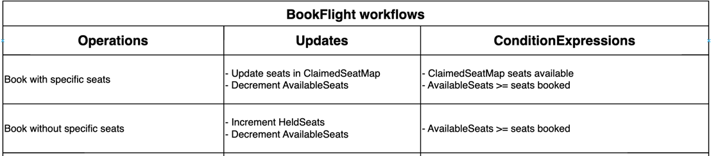
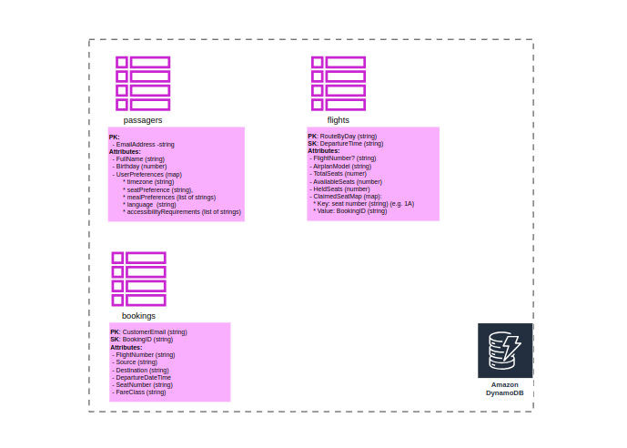

# 🚀 DynamoDB Operations with LocalStack for Airline Use-Cases

### Analyzed Use Case: Booking a Flight (with or without a specified seat)

#### DynamoDB Workflow Operations


#### Database Schema


## 📌 Tech Stack

- **Java 21** (via [SDKMAN!](https://sdkman.io/))
- **Maven Wrapper** for build automation
- **Docker Compose** for container orchestration
- **AWS CLI** (configured for LocalStack for local AWS simulation)

## 🏗️ Setup & Usage

### 0️⃣ Configure AWS CLI for LocalStack

Before running the project, ensure that you configure the AWS CLI to interact with LocalStack. Run the following commands:

```bash
aws configure set aws_access_key_id "key" --profile localstack
aws configure set aws_secret_access_key "secret" --profile localstack
aws configure set region "eu-west-1" --profile localstack
aws configure set output "json" --profile localstack
```

### 1️⃣ Start LocalStack with Docker Compose

Ensure Docker is running, then execute:
```shell
docker compose -f compose.yaml up -d
```

### 2️⃣ Create CloudFormation Stack

Deploy the CloudFormation stack to provision DynamoDB tables:
```shell
aws --profile localstack --endpoint-url=http://localhost:4566 cloudformation deploy \
    --template-file  cfTemplate.yaml \
    --stack-name airline-ddb-ops
```

### 3️⃣ Delete CloudFormation Stack

Run the following AWS CLI command to delete the CloudFormation stack:
```shell
aws --profile localstack --endpoint-url=http://localhost:4566 cloudformation \
delete-stack --stack-name airline-ddb-ops
```

### 4️⃣ Drop Docker Compose with Volumes
If Docker is running, then execute:
```shell
docker compose -f compose.yaml down -v
```
